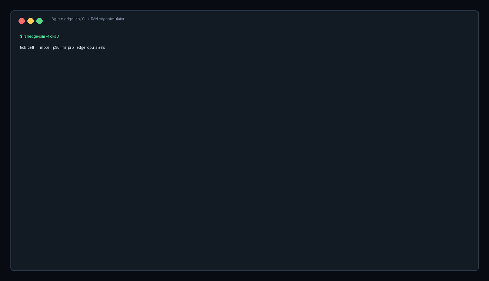
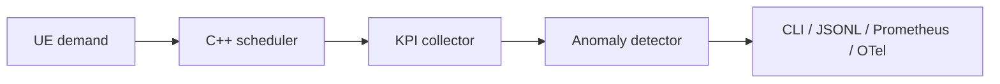

# 6g-ran-edge-lab

C++ wireless edge lab for modeling RAN capacity, slice-aware scheduling, mobility pressure, and platform observability across LTE, 5G NR, Wi-Fi, and 6G research scenarios.



This repo is meant to show the kind of systems thinking that sits between wireless domain work and platform engineering: radio-facing constraints, edge host pressure, useful telemetry, and deployable ops artifacts in one small project.

It is standards-inspired, not a production 3GPP stack. No private lab logs, vendor configs, or company-specific details are included.

## What is inside

- C++17 simulator for UE demand, channel quality, slice policy, and scheduler allocation
- KPI snapshots for throughput, p95 latency, PRB utilization, mobility instability, and edge CPU pressure
- Rolling anomaly detector for latency regression, air-interface saturation, CPU pressure, and handover-like instability
- Table, JSONL, Prometheus metrics, OpenTelemetry-shaped logs, and OpenTelemetry-shaped trace events
- Bare-metal runbook, systemd unit, Kubernetes Job, Prometheus rules, and OTel collector example
- Unit tests with CTest
- GitHub Actions CI and a small Dockerfile for containerized smoke runs

## Quick start

```bash
make
make test
./build/ranedge-sim --ticks 10
./build/ranedge-sim --ticks 4 --json
./build/ranedge-sim --ticks 8 --metrics
./build/ranedge-sim --ticks 8 --otel-logs
./build/ranedge-sim --ticks 8 --otel-traces
```

Container smoke run:

```bash
docker build -t ranedge-sim .
docker run --rm ranedge-sim --ticks 6 --json
```

## Example output

```text
tick  cell        mbps     p95_ms  prb    edge_cpu  alerts
----  ----------  -------  ------  -----  --------  -----------------------------
   1  lab-ran-01    426.9    18.8   0.61      55.9  ok
   5  lab-ran-01    465.4    25.0   0.67      59.3  latency-regression
   7  lab-ran-01    527.0    25.0   0.75      64.8  air-interface-saturation
```

## Why I built it this way

Wireless platform work is rarely just one layer. A scheduler decision can show up as latency. A mobility event can look like a service regression. Edge CPU pressure can look like a radio problem if the observability is weak.

This lab keeps the moving parts small enough to read, but real enough to talk through:

- How slice priorities affect control traffic versus eMBB and IoT demand
- Why deterministic C++ code is useful for low-latency platform experiments
- How JSONL output can feed a larger observability path without coupling the simulator to a specific stack
- Why logs, metrics, and traces need to tell the same story during a RAN edge incident
- What a bare-metal readiness checklist should cover before Kubernetes enters the picture

## Architecture

See [docs/architecture.md](docs/architecture.md).



## Ops artifacts

- [Bare-metal runbook](docs/baremetal-runbook.md)
- [Observability guide](docs/observability.md)
- [Kubernetes Job](ops/kubernetes/job.yaml)
- [Prometheus rules](ops/prometheus/rules.yml)
- [OpenTelemetry Collector config](ops/otel/collector.yaml)
- [systemd unit](ops/systemd/ranedge-sim.service)

## Roadmap

- Add PCAP-inspired synthetic packet counters
- Add a C API shim for embedding the simulator in other harnesses
- Add Linux perf sample parsing for host-level correlation

## Safety note

This is a public learning and showcase repo. It uses synthetic scenarios only.
