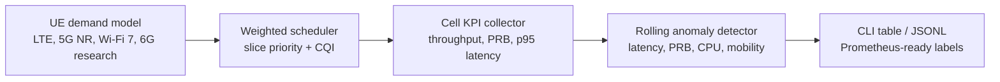

# Architecture

`6g-ran-edge-lab` is a small C++ lab for wireless platform observability. It does not claim to implement a real 3GPP stack. The goal is to model the kinds of tradeoffs a platform engineer sees around radio capacity, edge CPU pressure, mobility events, and service-level slices.

## Why this shape

- C++ keeps the hot path close to the systems work: deterministic scheduling, allocation math, and low-overhead telemetry formatting.
- The simulator is intentionally dependency-light so it can run on a laptop, CI runner, edge node, or bare-metal lab host.
- DevOps artifacts live beside the code because wireless platform work usually fails at the boundary between radio software, host performance, and observability.

## Domain assumptions

- `SixGResearch` is a research-mode enum, not a production 6G implementation.
- Slice priorities approximate how control traffic, eMBB, IoT sensing, and Wi-Fi offload may compete for capacity.
- Alert names are operational signals, not vendor-specific alarms.
