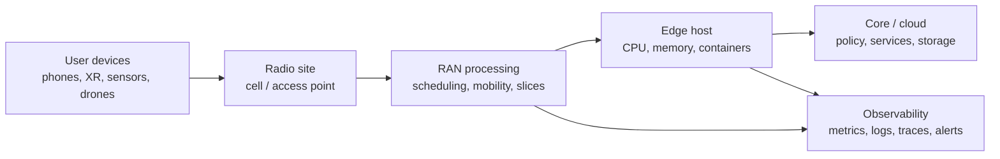
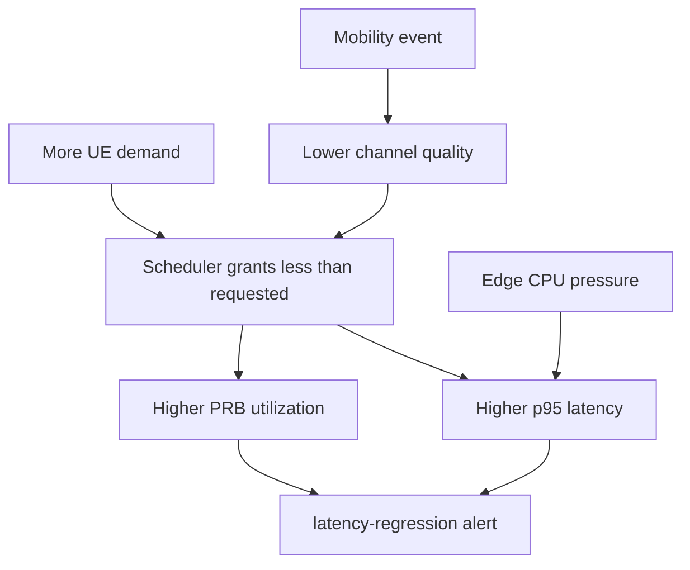
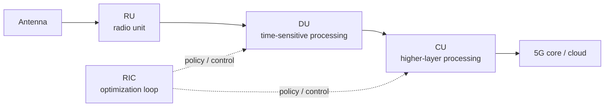
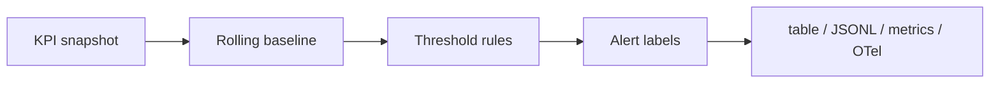
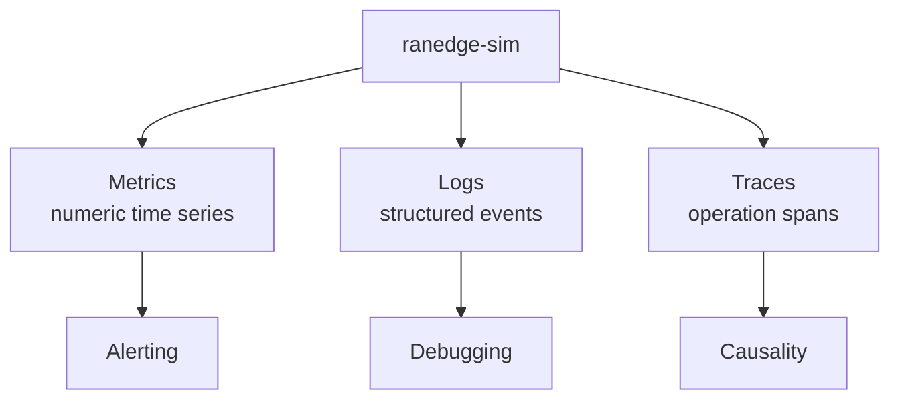
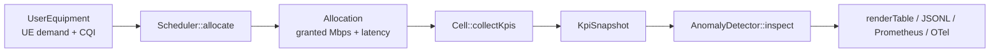

# Key Terms and Acronyms

This guide explains the wireless, edge, and observability terms used in `6g-ran-edge-lab`. The repo is standards-inspired and synthetic. It is not a production LTE, 5G, Wi-Fi, O-RAN, or 6G stack.

The short version: this project models how radio demand, scheduler choices, mobility events, and edge host pressure can show up as operational telemetry.

## What "6G RAN edge" means

`6G RAN edge` combines three ideas:

- `6G`: research direction for mobile networks beyond 5G. The ITU calls the future family `IMT-2030`; 3GPP work is still moving through study and standardization phases. In this repo, `SixGResearch` means "research-mode assumptions", not a finished 6G protocol.
- `RAN`: Radio Access Network. This is the part of a mobile network that connects user devices to the operator network through radio sites, cells, baseband processing, and radio control.
- `Edge`: compute placed close to the radio site or aggregation point so latency-sensitive work can run near the user instead of in a faraway region.

In plain English: a 6G RAN edge lab asks, "If future radio systems push more intelligence, sensing, automation, and low-latency workloads near the cell site, what pressure does that create on scheduling, CPU, latency, and observability?"



The simulator focuses on the middle of that diagram: scheduler allocation, KPI collection, anomaly detection, and telemetry output.

## Why this is not "just networking"

Wireless platform work crosses layers. A symptom can appear in one layer while the cause lives somewhere else.



Example: if XR devices and drone control traffic arrive at the same time, latency can rise because radio capacity is constrained. But latency can also rise because the edge host is overloaded. That is why the repo emits radio-ish KPIs and platform-ish telemetry together.

## Core wireless terms

### RAN

`RAN` means Radio Access Network. It includes the radio-facing pieces that connect user equipment to a mobile network. In a real deployment, this can include radio units, baseband processing, distributed units, centralized units, transport links, and control-plane integration.

In this repo, the RAN is simplified into:

- a `CellConfig`
- a set of `UserEquipment`
- a `Scheduler`
- KPI snapshots from `Cell::collectKpis`

### UE

`UE` means User Equipment. It is the device connecting to the network.

Examples:

- phone
- tablet
- XR headset
- vehicle modem
- sensor
- drone controller
- lab test device

In the simulator, UE records include:

- `id`: readable device name, such as `ue-xr-01`
- `tech`: access technology, such as LTE, 5G NR, Wi-Fi 7, or 6G research
- `slice`: service class, such as `urllc-control`
- `demandMbps`: requested throughput
- `channelQuality`: simplified radio quality score
- `mobilityEvent`: whether the device is moving or changing radio conditions

### Cell

A `cell` is a coverage and scheduling domain. In a mobile network, a cell usually means a specific radio coverage area served by radio equipment. In the simulator, `lab-ran-01` is the synthetic cell being modeled.

The cell has:

- radio technology
- bandwidth in MHz
- edge CPU budget
- slice policies
- scheduled users

`edge CPU budget` scales the modeled `edgeCpuUtilization` KPI: a smaller
budget (weaker or more contended edge host) shows CPU pressure sooner for
the same radio load, a larger budget absorbs more of it before the
`edge-cpu-pressure` alert fires. The default is `1.0`. Override it per run
with `--edge-cpu-budget`:

```bash
./build/ranedge-sim --ticks 8 --edge-cpu-budget 0.5 --json
```

### LTE

`LTE` means Long-Term Evolution. It is a 4G radio technology. In this repo, LTE appears as a lower spectral-efficiency access mode for IoT-style devices.

Example from the simulator:

```text
ue-sensor-a -> LTE -> iot-sensing -> low throughput demand
```

### 5G NR

`NR` means New Radio. It is the 5G radio access technology standardized by 3GPP.

In the simulator, 5G NR is used for XR/video-style demand:

```text
ue-xr-01 -> 5G NR -> embb-video -> high throughput demand
```

### Wi-Fi 7

`Wi-Fi 7` is IEEE 802.11be. It sits outside cellular RAN. Real edge environments often run cellular and Wi-Fi access side by side, so the simulator includes Wi-Fi offload to cover both.

### 6G / IMT-2030

`6G` is the common industry name for the next major generation of mobile networks after 5G. `IMT-2030` is the ITU name for the future international mobile telecommunications family for 2030 and beyond.

Useful framing:

- 6G is not a finished production standard in this repo.
- `SixGResearch` is a modeling label.
- The simulator borrows expected themes: higher capacity, lower latency, integrated AI/automation, sensing, and tighter edge integration.

References:

- ITU IMT-2030 overview: <https://www.itu.int/en/ITU-R/study-groups/rsg5/rwp5d/imt-2030/Pages/default.aspx>
- ITU-R M.2160 framework: <https://www.itu.int/rec/R-REC-M.2160-0-202311-I>
- 3GPP 6G workshop note: <https://www.3gpp.org/news-events/3gpp-news/6gworkshop-2025>

## RAN architecture acronyms

These terms are outside what the simulator implements. They are necessary context for understanding RAN edge conversations.

| Acronym | Meaning | Plain explanation |
|---|---|---|
| `RU` | Radio Unit | Handles radio frequency functions near the antenna. |
| `DU` | Distributed Unit | Handles time-sensitive lower-layer processing closer to the radio site. |
| `CU` | Centralized Unit | Handles higher-layer processing that can be centralized more easily than DU work. |
| `gNB` | Next-generation NodeB | 5G base station. It can be split into RU, DU, and CU pieces. |
| `eNB` | evolved NodeB | LTE base station. |
| `O-RAN` | Open Radio Access Network | Architecture and interfaces that aim to make RAN components more open and interoperable. |
| `RIC` | RAN Intelligent Controller | Control and optimization platform used in O-RAN architectures. |
| `Near-RT RIC` | Near-real-time RIC | RIC loop generally associated with near-real-time RAN optimization. |
| `Non-RT RIC` | Non-real-time RIC | RIC loop generally associated with slower policy, analytics, and training workflows. |



This project compresses that architecture into one simulator binary. That keeps the code readable while still letting you talk about the operational tradeoffs.

## Scheduling terms

### Scheduler

A scheduler decides how limited radio capacity should be shared across active users and service classes.

In this repo, the scheduler uses:

- slice priority
- simplified spectral efficiency
- channel quality
- requested Mbps
- available cell capacity

The simplified formula is:

```text
user_weight = slice_priority * spectral_efficiency(user_tech, channel_quality)
fair_share = cell_capacity * (user_weight / total_weight)
granted_mbps = min(user_demand_mbps, fair_share)
```

That is not a production scheduler. It is a readable model for interview and platform discussion.

### Slice

A `slice` is a logical service class with different performance goals. Network slicing is often discussed in 5G and future network architectures as a way to support different workloads on shared infrastructure.

The simulator has four slices:

| Slice | Intended workload | Priority | Example |
|---|---:|---:|---|
| `urllc-control` | low-latency control traffic | 3.0 | drone control |
| `embb-video` | high-bandwidth media | 1.7 | XR/video |
| `iot-sensing` | low-rate sensing | 1.1 | sensors |
| `wifi-offload` | non-cellular offload traffic | 1.4 | lab access point |

### URLLC

`URLLC` means Ultra-Reliable Low-Latency Communications. It refers to traffic where latency and reliability matter more than bulk throughput.

Examples:

- industrial control
- robotics
- remote operation
- drone command path

In the simulator:

```text
urllc-control -> higher priority -> lower latency target
```

### eMBB

`eMBB` means enhanced Mobile Broadband. It refers to high-throughput user traffic.

Examples:

- video
- XR
- large downloads
- high-bandwidth interactive media

In the simulator:

```text
embb-video -> high Mbps demand -> can push PRB utilization upward
```

### IoT

`IoT` means Internet of Things. In radio systems, IoT traffic often means many devices with relatively small payloads, power constraints, and different latency needs from media or control traffic.

In the simulator:

```text
iot-sensing -> low Mbps demand -> lower priority than control traffic
```

## Radio quality and capacity acronyms

### CQI

`CQI` means Channel Quality Indicator. Real CQI is a reported radio quality value that helps the network choose coding, modulation, and scheduling behavior.

In this repo, `channelQuality` is a simplified 0.0 to 1.0 score. Higher is better.

Example:

```text
channelQuality = 0.91 -> strong radio conditions
channelQuality = 0.58 -> weaker radio conditions during mobility
```

### PRB

`PRB` means Physical Resource Block. In cellular systems, PRBs are time-frequency chunks of radio capacity.

In this repo, `prbUtilization` is a simplified ratio:

```text
0.61 -> about 61% of modeled radio capacity is used
0.75 -> about 75% of modeled radio capacity is used
```

When PRB utilization rises quickly, the anomaly detector can emit:

```text
air-interface-saturation
```

### MHz

`MHz` means megahertz. It measures spectrum bandwidth. More bandwidth can mean more potential capacity. Real capacity also depends on radio quality, modulation, interference, antenna design, and scheduler behavior.

In the simulator:

```text
capacityMbps = bandwidthMhz * spectralEfficiency(...)
```

### Spectral efficiency

Spectral efficiency is a rough measure of how many bits can be carried per unit of spectrum. Better radio technology and better channel quality can increase it.

In this repo, spectral efficiency is intentionally simple:

```text
LTE           -> lower modeled efficiency
5G NR         -> higher modeled efficiency
Wi-Fi 7       -> high modeled efficiency
SixGResearch  -> highest modeled efficiency
```

## Mobility terms

### Mobility event

A mobility event means the device's radio conditions are changing. In a real network, this could involve movement, fading, handover, beam changes, or changing interference.

In this repo, `mobilityEvent = true` does two things:

- lowers channel quality for selected users
- adds latency penalty in scheduler allocation

### Handover

A handover moves a device session from one cell or radio path to another. Failed or unstable handovers can look like latency spikes, drops, retransmissions, or service interruption.

The simulator does not implement real handover state machines. It models a handover-like signal through `handoverFailures` and the `mobility-instability` alert.

## KPI and alert terms

### KPI

`KPI` means Key Performance Indicator. It is a measurement used to understand system health.

The simulator reports:

| KPI | Meaning |
|---|---|
| `throughputMbps` | total granted throughput in Mbps |
| `p95LatencyMs` | 95th percentile modeled latency in milliseconds |
| `prbUtilization` | modeled radio capacity usage |
| `handoverFailures` | synthetic mobility instability signal |
| `edgeCpuUtilization` | modeled edge host CPU usage |
| `alerts` | anomaly labels emitted for the tick |

### p95 latency

`p95 latency` means 95% of observed requests or events are at or below this latency. It is often more useful than average latency because averages can hide tail pain.

Example:

```text
p95_latency_ms = 25.0
```

That means most modeled events are at or below 25 ms, while the slowest 5% may be worse.

### Mbps

`Mbps` means megabits per second. It measures throughput, not storage size.

Example:

```text
426.9 Mbps
```

This is the modeled aggregate throughput granted by the scheduler for a tick.

### MTTR

`MTTR` means Mean Time To Recovery or Mean Time To Resolve, depending on the team. It is the time from detection to recovery or resolution. The repo does not calculate MTTR directly. Its alerts and telemetry are the kind of signals that reduce MTTR in a real platform.

### Anomaly detector

The anomaly detector looks at rolling history and emits operational labels.

| Alert | What it means in this repo |
|---|---|
| `latency-regression` | p95 latency rose above recent baseline and crossed a threshold |
| `air-interface-saturation` | PRB utilization rose above recent baseline and crossed a threshold |
| `edge-cpu-pressure` | modeled edge CPU exceeded threshold |
| `mobility-instability` | handover-like failures crossed threshold |



## Edge and platform terms

### Edge compute

Edge compute means running workloads closer to users, devices, or radio sites. The goal is usually lower latency, lower backhaul load, local data handling, or better resilience.

In a RAN edge context, edge compute might host:

- telemetry collectors
- packet processing helpers
- inference services
- control-plane helpers
- test harnesses
- local dashboards

### Bare metal

`Bare metal` means running directly on physical servers instead of only inside a cloud VM abstraction. RAN and low-latency workloads often care about bare-metal details such as CPU pinning, NUMA layout, NIC queues, kernel settings, and real-time scheduling.

The repo includes [baremetal-runbook.md](baremetal-runbook.md) to show what a platform readiness checklist can look like.

### NUMA

`NUMA` means Non-Uniform Memory Access. On multi-socket or larger systems, CPU cores may access some memory faster than other memory. Poor NUMA placement can cause latency surprises.

### RT scheduling

`RT` means real-time. Real-time scheduling settings can give latency-sensitive processes different CPU scheduling behavior. The repo does not hardcode RT settings because they should depend on the host profile.

### Kubernetes

`Kubernetes` is a container orchestration platform. It schedules containers, manages job lifecycle, and provides deployment primitives. This repo includes a Kubernetes Job as an ops artifact. The simulator itself does not require Kubernetes to run.

### systemd

`systemd` is a Linux service manager. The repo includes a systemd unit to show how the simulator could be run as a managed service on a Linux host.

## Observability acronyms

### Observability

Observability is the ability to understand system behavior from emitted signals. For platform work, the main signals are metrics, logs, traces, and alerts.



### JSONL

`JSONL` means JSON Lines. Each line is a complete JSON object. It is useful for streaming logs because tools can process one event at a time.

Example:

```json
{"tick":7,"cell":"lab-ran-01","throughput_mbps":527.0,"p95_latency_ms":25.0,"prb_utilization":0.75,"edge_cpu_utilization":64.8,"alerts":["air-interface-saturation"]}
```

### Prometheus

Prometheus is a metrics and alerting system. The simulator can print Prometheus-style metric text with:

```bash
./build/ranedge-sim --ticks 8 --metrics
```

Example metric names:

```text
ranedge_throughput_mbps
ranedge_p95_latency_ms
ranedge_prb_utilization
ranedge_edge_cpu_utilization
ranedge_alert_total
```

### OTel

`OTel` means OpenTelemetry. It is a vendor-neutral standard for collecting telemetry such as logs, metrics, and traces.

The repo emits OTel-shaped logs and traces without requiring the application to link against an OTel SDK:

```bash
./build/ranedge-sim --ticks 8 --otel-logs
./build/ranedge-sim --ticks 8 --otel-traces
```

### Collector

An OpenTelemetry Collector receives, processes, and exports telemetry. The sample config in [ops/otel/collector.yaml](../ops/otel/collector.yaml) shows where logs and metrics could go in a real platform path.

### Trace

A trace describes work across time. A trace is made of spans.

In this repo:

```text
one scheduler tick -> one span
alert on that tick -> span event
```

### Span

A span is one timed operation inside a trace. For example, a scheduler tick can be represented as a span with attributes such as cell ID, p95 latency, and PRB utilization.

## How the simulator maps terms to code



| Concept | Code location |
|---|---|
| Radio technology enum | `include/ranedge/types.hpp` |
| UE model | `UserEquipment` in `include/ranedge/types.hpp` |
| Slice policy | `SlicePolicy` in `include/ranedge/types.hpp` |
| Scheduler allocation | `src/scheduler.cpp` |
| Scenario generation | `Simulation::usersForTick` in `src/simulation.cpp` |
| KPI snapshot | `KpiSnapshot` in `include/ranedge/types.hpp` |
| Alert logic | `src/anomaly_detector.cpp` |
| Metrics, logs, traces | `src/telemetry.cpp` |

## Walkthrough example

During a busy tick, the simulator increases demand for drone control, XR/video, and Wi-Fi offload. Some users also experience mobility pressure.

```text
tick 7:
  ue-drone-ctrl demand rises
  ue-xr-01 and ue-xr-02 demand rises
  channel quality drops for moving users
  scheduler grants capacity based on slice priority and channel quality
  PRB utilization rises
  anomaly detector emits air-interface-saturation
```

The table output turns that into an operator-readable signal:

```text
tick  cell        mbps     p95_ms  prb    edge_cpu  alerts
----  ----------  -------  ------  -----  --------  -----------------------------
   7  lab-ran-01    527.0    25.0   0.75      64.8  air-interface-saturation
```

The same event can also be emitted as JSONL, Prometheus metrics, or OTel-shaped telemetry so it can fit into different platform workflows.

## Acronym quick reference

| Acronym | Expansion |
|---|---|
| `3GPP` | 3rd Generation Partnership Project |
| `5G NR` | 5G New Radio |
| `6G` | Sixth-generation mobile network research direction |
| `API` | Application Programming Interface |
| `CQI` | Channel Quality Indicator |
| `CPU` | Central Processing Unit |
| `CU` | Centralized Unit |
| `DU` | Distributed Unit |
| `eMBB` | enhanced Mobile Broadband |
| `eNB` | evolved NodeB |
| `gNB` | next-generation NodeB |
| `IMT-2030` | International Mobile Telecommunications for 2030 and beyond |
| `IoT` | Internet of Things |
| `JSONL` | JSON Lines |
| `KPI` | Key Performance Indicator |
| `LTE` | Long-Term Evolution |
| `MHz` | Megahertz |
| `Mbps` | Megabits per second |
| `MTTR` | Mean Time To Recovery or Mean Time To Resolve |
| `NUMA` | Non-Uniform Memory Access |
| `O-RAN` | Open Radio Access Network |
| `OTel` | OpenTelemetry |
| `PRB` | Physical Resource Block |
| `RAN` | Radio Access Network |
| `RIC` | RAN Intelligent Controller |
| `RT` | Real-time |
| `RU` | Radio Unit |
| `UE` | User Equipment |
| `URLLC` | Ultra-Reliable Low-Latency Communications |
| `XR` | Extended Reality |
