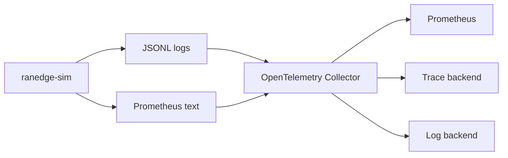

# Observability

The simulator emits three useful telemetry shapes without requiring a runtime collector or vendor SDK:

- Prometheus exposition with `--metrics`
- OpenTelemetry-shaped structured logs with `--otel-logs`
- OpenTelemetry-shaped span events with `--otel-traces`

That keeps the core binary dependency-light while still showing how the data would flow through a real platform stack.

## Metrics

```bash
./build/ranedge-sim --ticks 8 --metrics
```

Example metric names:

- `ranedge_throughput_mbps`
- `ranedge_p95_latency_ms`
- `ranedge_prb_utilization`
- `ranedge_edge_cpu_utilization`
- `ranedge_alert_total`

## Logs

```bash
./build/ranedge-sim --ticks 8 --otel-logs
```

Each line is a structured log record with resource, scope, severity, and attributes such as:

- `service.name`
- `cell.id`
- `radio.access`
- `ran.p95_latency_ms`
- `edge.cpu_utilization`
- `alerts`

## Traces

```bash
./build/ranedge-sim --ticks 8 --otel-traces
```

Each scheduler tick becomes a trace span. Alerting ticks include span events such as `latency-regression` and `air-interface-saturation`.

## Collector path

The sample collector config in [ops/otel/collector.yaml](../ops/otel/collector.yaml) shows a realistic local path:



This is intentionally vendor-neutral. Swap the exporters for Datadog, Honeycomb, Grafana Cloud, Splunk, or an internal collector if needed.
